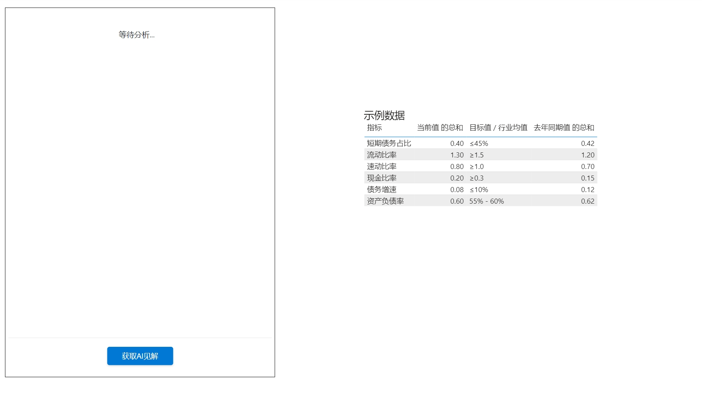
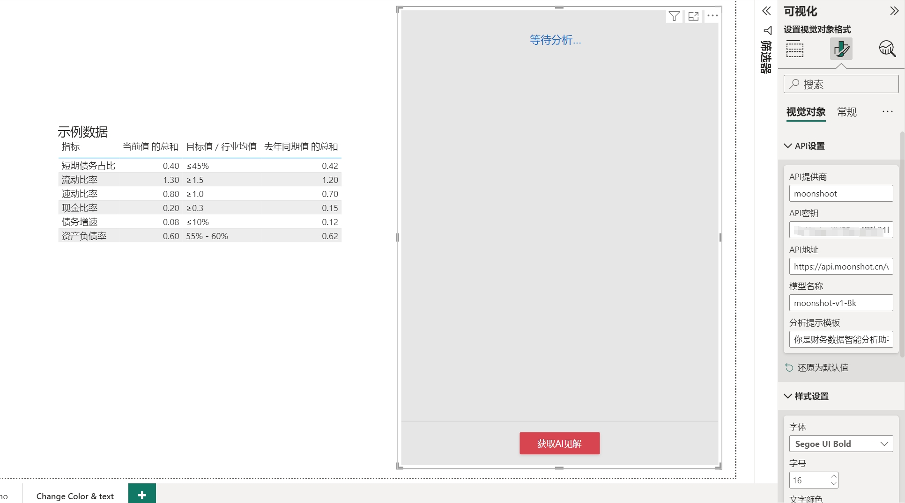
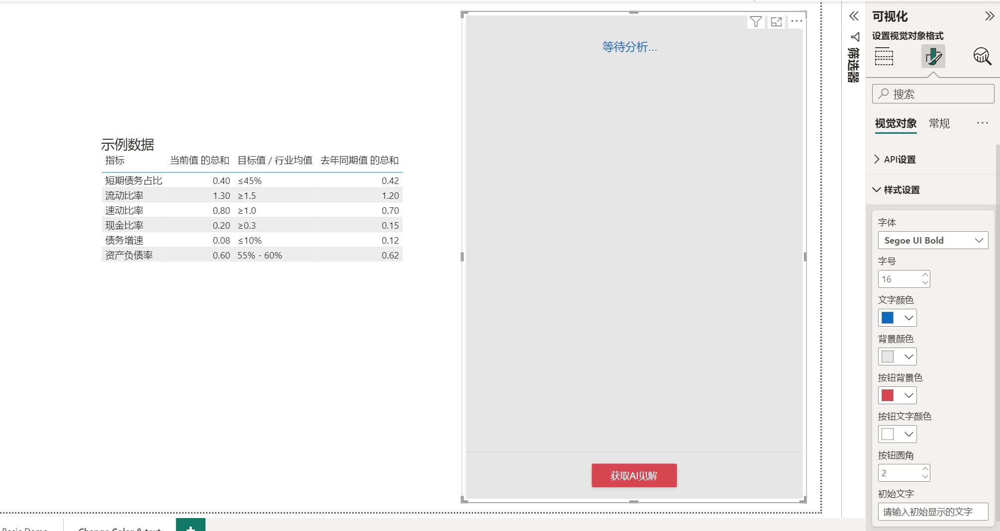
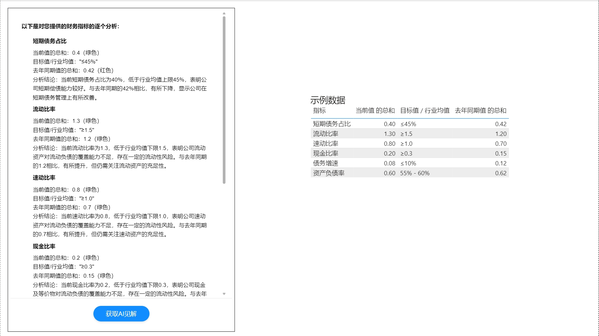

# LlmAISpeaker for Power BI

一个强大的 Power BI AI 分析视觉对象，能够通过 AI 模型智能分析数据并生成见解。

A powerful Power BI visual that provides AI-powered data analysis and insights generation.

## ✨ 特性 | Features

- 🤖 AI 驱动的数据分析 | AI-Powered Data Analysis
  - 支持多种主流 AI 服务提供商（OpenAI、Moonshot 等）
  - Support for multiple AI service providers (OpenAI, Moonshot, etc.)

- 📝 灵活的提示词配置 | Flexible Prompt Configuration
  - 自定义分析提示模板
  - Customizable analysis prompt templates

- 🎨 丰富的样式设置 | Rich Style Settings
  - 自定义字体、颜色、按钮样式等
  - Customize fonts, colors, button styles, etc.

- 🔄 实时分析 | Real-time Analysis
  - 实时生成数据分析报告和建议
  - Generate real-time data analysis reports and recommendations

- 🌏 本地化支持 | Localization Support
  - 完整的中文支持
  - Full Chinese language support

## 📈 使用示例 | Usage Examples

### 主界面 | Main Interface

主界面展示了数据分析结果和交互按钮，简洁直观的设计让您专注于数据洞察。

The main interface shows analysis results and interaction buttons, with a clean design that lets you focus on data insights.

### API 设置 | API Settings

在 API 设置中，您可以：
- 选择 AI 服务提供商（OpenAI/Moonshot）
- 配置 API 密钥
- 设置自定义 API 地址
- 选择合适的模型
- 自定义分析提示模板

In API settings, you can:
- Choose AI service provider (OpenAI/Moonshot)
- Configure API key
- Set custom API endpoint
- Select appropriate model
- Customize analysis prompt template

### 样式设置 | Style Settings

丰富的样式设置选项：
- 字体选择（支持多种中文字体）
- 颜色主题定制
- 按钮样式调整
- 界面布局优化

Rich style settings options:
- Font selection (multiple Chinese fonts supported)
- Color theme customization
- Button style adjustment
- Interface layout optimization

### 分析演示 | Analysis Demo

实际数据分析场景展示：
1. 选择要分析的数据
2. 点击分析按钮
3. 获取 AI 生成的专业见解

Real data analysis scenario:
1. Select data for analysis
2. Click analyze button
3. Get AI-generated professional insights

## 📦 安装 | Installation

1. 下载最新版本的 .pbiviz 文件
2. 在 Power BI Desktop 中导入自定义视觉对象：
   - 点击"可视化"窗格中的"..."
   - 选择"从文件导入视觉对象"
   - 选择下载的 .pbiviz 文件
3. 将视觉对象添加到您的报表中

---

1. Download the latest .pbiviz file
2. Import custom visual in Power BI Desktop:
   - Click "..." in the Visualizations pane
   - Choose "Import visual from file"
   - Select the downloaded .pbiviz file
3. Add the visual to your report

## 🔧 配置 | Configuration

### API 设置 | API Settings

1. 选择 AI 服务提供商
   - 支持 OpenAI 和 Moonshot
   - 可自定义其他兼容服务

2. 配置 API 密钥
   - 在服务提供商获取 API 密钥
   - 填入对应的配置项

3. 设置 API 地址（可选）
   - 默认使用官方接口
   - 可配置自定义代理地址

4. 选择模型
   - 支持 GPT-3.5/4.0
   - 支持 Moonshot 系列模型

5. 自定义提示词模板
   - 预设多种分析模板
   - 支持自定义分析角度

### 样式设置 | Style Settings

- 字体设置 | Font settings
  - 多种中文字体选择
  - 自定义字号大小

- 颜色配置 | Color configuration
  - 主题色调整
  - 文字颜色设置
  - 背景色定制

- 按钮样式 | Button styles
  - 圆角大小调整
  - 悬停效果设置
  - 配色方案选择

- 界面布局 | Interface layout
  - 组件间距调整
  - 对齐方式设置
  - 响应式布局

## 🤝 贡献 | Contributing

欢迎提交 Issue 和 Pull Request！

Issues and Pull Requests are welcome!

## 📄 许可证 | License

[MIT License](LICENSE)

## 👥 作者 | Author

- xiaochuan (lujunfeng5440614@live.cn) 